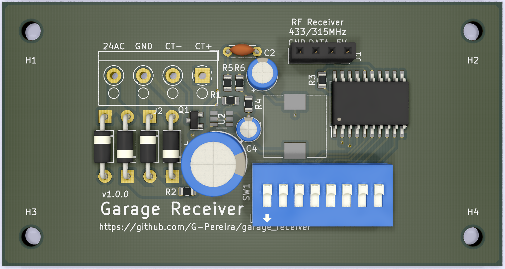

# Garage Receiver
A home made receiver to replace a broken one

## CADLAB View

View this project on [CADLAB.io](https://cadlab.io/project/1891). 

## How it works

This board works with 24V AC power supply and reponds to an RF signal which makes the input CT+ and CT- connect to each other and that makes the door open or close. The RF receiver is not included since they are readily available and some of you would need 443MHz and others 315MHz to interface with existing hardware.
You can use your existing remote by configuring the code with the switches.

## New features

In case you need more features feel free to ask for additions to the board! (Or make a pull request)

## License

Make sure to check the [License](LICENSE) file for information regarding the contents of this repository.
